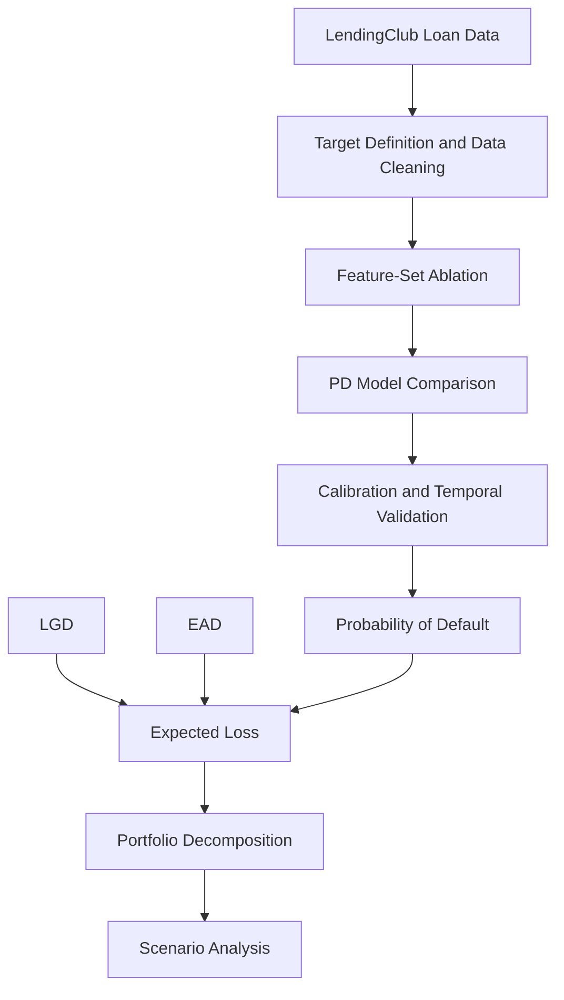
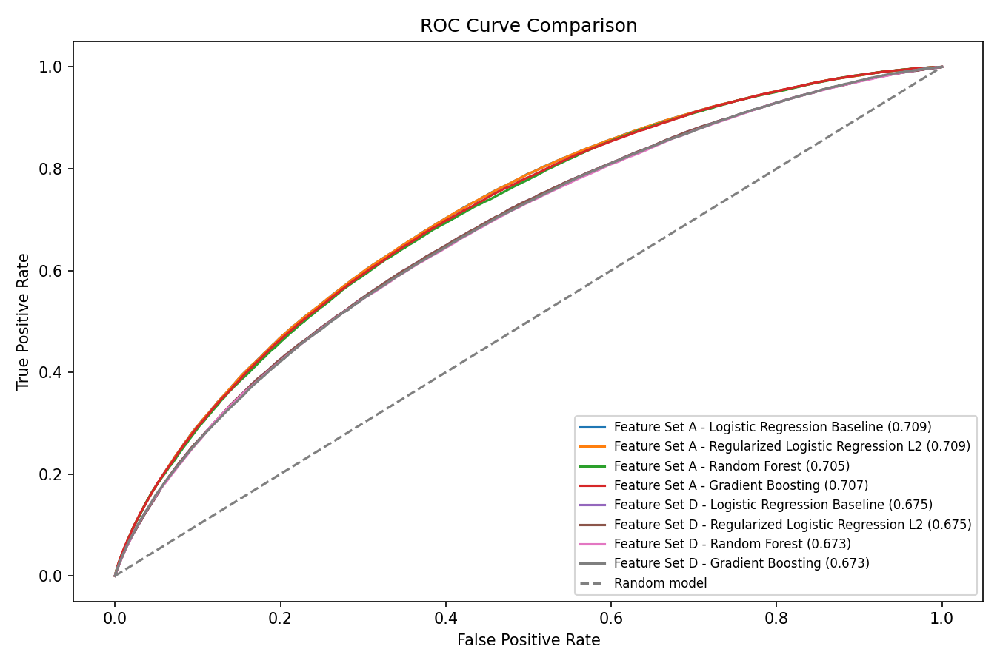
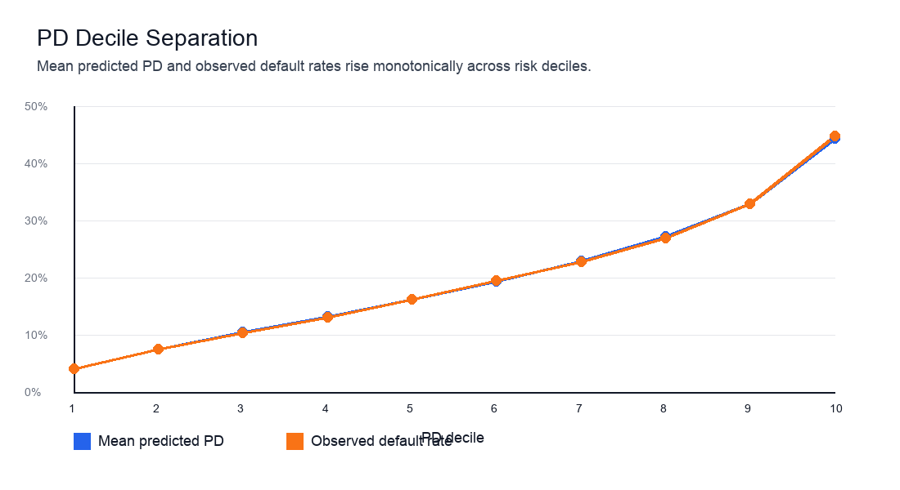
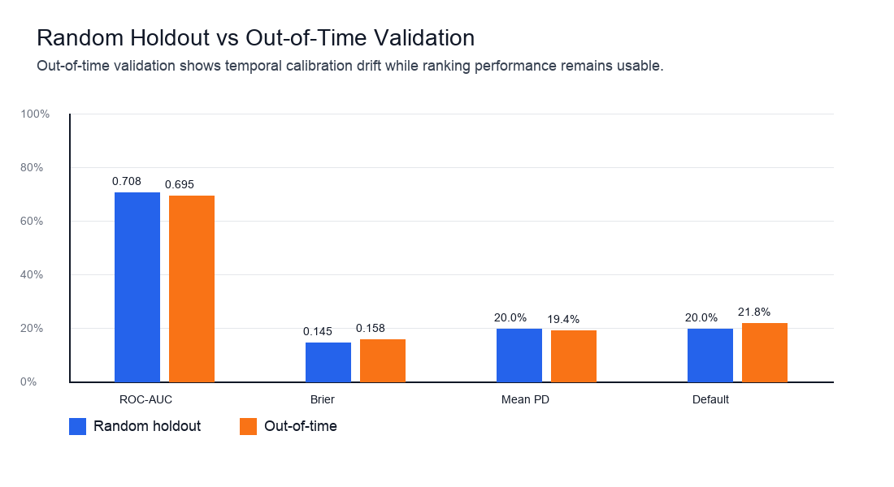
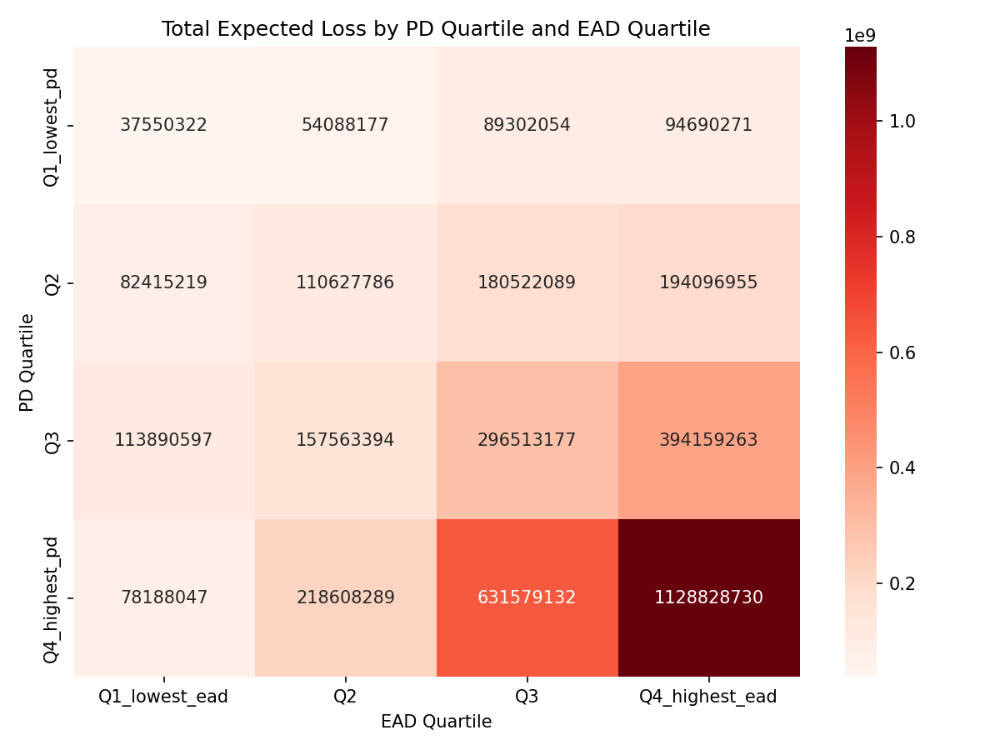

# Credit Risk Modeling and Expected Loss Engine

**PD modeling, temporal validation, LGD/EAD estimation, and portfolio expected-loss analysis on approximately 1.35 million LendingClub loans.**

This project studies whether an interpretable credit-risk model can produce stable probability-of-default estimates when available predictors include both borrower characteristics and variables that partially embed the lender's own underwriting signal. Multiple feature specifications and model families are compared, followed by calibration analysis, Out-of-Time (OOT) validation, LGD sensitivity testing, and portfolio expected-loss decomposition.

The primary contribution is modeling judgment and validation: separating discrimination from calibration, testing borrower-only signal against platform-informed signal, and translating probability estimates into portfolio-level risk measures.

## Key Findings

- **Interpretable models were competitive.** L2 logistic regression achieved ROC-AUC of `0.7093` and Average Precision (AP) of `0.3701`, while gradient boosting and random forest produced no material improvement.
- **Borrower information retained independent predictive value.** Removing LendingClub grade, sub-grade, and interest rate reduced ROC-AUC from `0.7094` to `0.6747`, indicating that borrower and loan attributes still contain meaningful default signal.
- **Temporal validation exposed model risk.** Out-of-time ROC-AUC declined to `0.6953`, and average predicted PD understated the observed default rate by about `2.45` percentage points.
- **Expected-loss estimates were sensitive to LGD definitions.** Recovery-based LGD produced baseline Expected Loss of `$3.86B`; payment-inclusive LGD definitions reduced portfolio Expected Loss materially.

## Pipeline



## Model Development

| Model / Feature Set | ROC-AUC | Average Precision (AP) | Interpretation |
| --- | ---: | ---: | --- |
| Platform-informed logistic regression | 0.7094 | 0.3701 | Strongest baseline feature specification |
| Borrower-only logistic regression | 0.6747 | 0.3388 | Measures borrower signal without embedded lender grades/pricing |
| L2 logistic regression | 0.7093 | 0.3701 | Retains performance with regularization and interpretability |
| Gradient boosting | 0.7068 | 0.3700 | No meaningful nonlinear improvement |
| Random forest | 0.7050 | 0.3676 | No meaningful improvement over logistic alternatives |

**Model selection:** L2 logistic regression was retained because nonlinear models did not materially improve discrimination, while the logistic specification preserved interpretability and stability.

## Embedded Underwriting Signal Ablation

Two feature specifications were intentionally compared:

- **Platform-informed specification:** includes LendingClub `grade`, `sub_grade`, `int_rate`, and borrower/loan attributes.
- **Borrower-only specification:** excludes LendingClub grade, sub-grade, and interest rate to evaluate borrower/loan signal without the strongest platform-generated underwriting and pricing variables.

Removing platform-generated underwriting variables reduced ROC-AUC from `0.7094` to `0.6747`. This suggests that borrower characteristics retain meaningful predictive power while LendingClub's own pricing and risk grades contribute substantial incremental discrimination.

## Holdout vs Out-of-Time Validation

The random-holdout results come from a random split of the resolved modeling sample. The Out-of-Time (OOT) validation uses a date-based split: loans originated on or after `2016-10-01` are excluded from the time-training and time-calibration samples and evaluated as the OOT cohort. The final OOT set contains `282,970` loans; the pre-cutoff development sample contains `1,062,380` loans, split into `796,785` time-training rows and `265,595` time-calibration rows for calibration testing.

| Metric | Random Holdout | Out-of-Time |
| --- | ---: | ---: |
| ROC-AUC | 0.7084 | 0.6953 |
| Average Precision (AP) | 0.3689 | 0.3681 |
| Brier Score | 0.1455 | 0.1579 |
| Log Loss | 0.4553 | 0.4875 |
| Gini | 0.4169 | 0.3906 |
| KS Statistic | 0.3027 | N/A |
| Mean Predicted PD | 19.97% | 19.37% |
| Observed Default Rate | 19.97% | 21.82% |

The principal model-risk finding is not a collapse in ranking performance, but deterioration in temporal calibration. The model continued to rank borrowers reasonably well while systematically underestimating the level of default risk in the OOT cohort.

Holdout ROC-AUC was `0.7084`; a 500-resample bootstrap produced a 95% confidence interval of `[0.7063, 0.7108]`.

## Model Interpretation

The selected logistic model is interpretable through coefficient direction and exponentiated coefficient values. These should be read as conditional associations within the selected multivariate specification, not causal effects.

| Feature | Coefficient | Exp(Coefficient) | Risk Direction |
| --- | ---: | ---: | --- |
| `categorical__grade_G` | 0.6723 | 1.9587 | higher estimated default probability |
| `categorical__grade_F` | 0.5418 | 1.7191 | higher estimated default probability |
| `categorical__addr_state_MS` | 0.4325 | 1.5411 | higher estimated default probability |
| `categorical__grade_E` | 0.3343 | 1.3969 | higher estimated default probability |
| `categorical__addr_state_AR` | 0.3164 | 1.3722 | higher estimated default probability |

**Interpretation note:** Coefficients represent conditional associations within the regularized multivariate specification. Several underwriting variables are correlated, particularly grade, sub-grade, and interest rate, so individual coefficient signs and magnitudes should not be interpreted in isolation or as causal effects.

Full coefficient output is stored in [`models/pd_coefficients.csv`](models/pd_coefficients.csv).

## Expected Loss Framework

Loan-level baseline Expected Loss is calculated as:

```text
Expected Loss = PD x LGD x EAD
```

The final portfolio framework uses:

| Component | Selected Approach |
| --- | --- |
| PD | Uncalibrated L2 logistic regression |
| LGD | Recovery-based portfolio-average LGD |
| EAD | Funded amount proxy |
| EL | Loan-level `PD x LGD x EAD` |

## LGD Sensitivity

| LGD Definition | Mean LGD | Portfolio Expected Loss |
| --- | ---: | ---: |
| Gross recovery | 92.47% | $3.86B |
| Recovery net of fees | 93.72% | $3.91B |
| Principal recovery | 69.73% | $2.91B |
| Total payment | 46.70% | $1.95B |
| Net cashflow | 41.35% | $1.73B |

The exercise demonstrates that expected-loss estimates can be highly sensitive to the definition of economic recovery and LGD, particularly when using retrospective loan performance data.

## Expected Loss Reasonableness Check

Baseline Expected Loss was close to the gross-recovery realized-loss proxy, with an EL / realized-loss ratio of `1.0023`. This is an internal consistency check, not independent external validation, because both measures rely on related recovery and exposure information.

## Selected Figures

**Model family ROC comparison**



**PD decile separation**



**Random holdout vs Out-of-Time validation**



**Expected Loss concentration by PD and EAD**



## Repository Structure

```text
.
├── app/                 # Streamlit dashboard
├── data/                # Data documentation and demo sample
├── models/              # Human-readable model metadata and coefficient outputs
├── notebooks/           # Four cleaned analysis notebooks
├── reports/             # Technical report, figures, and generated tables
├── src/credit_risk/     # Reusable analysis package
├── tests/               # Lightweight financial logic tests
├── LICENSE
├── pyproject.toml
└── requirements.txt
```

## Run The Dashboard

Install dependencies:

```bash
python3 -m pip install -r requirements.txt
```

Run locally:

```bash
python3 -m streamlit run app/streamlit_app.py
```

The dashboard uses the full loan-level file when available:

```text
data/processed/loans_with_pd_lgd_ead_v1.csv
```

If the full file is absent, it falls back to the included demo sample:

```text
data/demo/loans_with_pd_lgd_ead_sample_v1.csv
```

## Explore The Analysis

The four public notebooks provide a cleaned, executable walkthrough of the project's main analytical stages and consume selected intermediate/result artifacts generated during the full modeling workflow. They are designed for transparency and review rather than as a raw-data-to-final-output production pipeline.

Run the notebooks in order:

```text
notebooks/01_data_and_target.ipynb
notebooks/02_pd_modeling_and_validation.ipynb
notebooks/03_lgd_ead_expected_loss.ipynb
notebooks/04_portfolio_risk_and_scenarios.ipynb
```

The original LendingClub accepted-loan source file is documented but not committed. See [`data/README.md`](data/README.md) for the raw-data source, excluded large files, and committed demo artifacts.

## Assumptions and Limitations

- LendingClub `grade`, `sub_grade`, and `int_rate` partially embed the lender's existing underwriting and pricing signal.
- The accepted-loan sample does not represent the full applicant population.
- EAD is approximated using available funded amount information rather than a full exposure-at-default model.
- Baseline LGD is simplified and sensitive to the definition of economic recovery.
- Out-of-time validation indicates temporal calibration drift.
- Scenario analysis applies deterministic shocks and is not an econometrically estimated macro stress-testing model.
- The project is an analytical research framework rather than a regulatory capital or accounting provisioning system.

## Detailed Report

See [`reports/TECHNICAL_REPORT.md`](reports/TECHNICAL_REPORT.md) for the full methodology and results.
